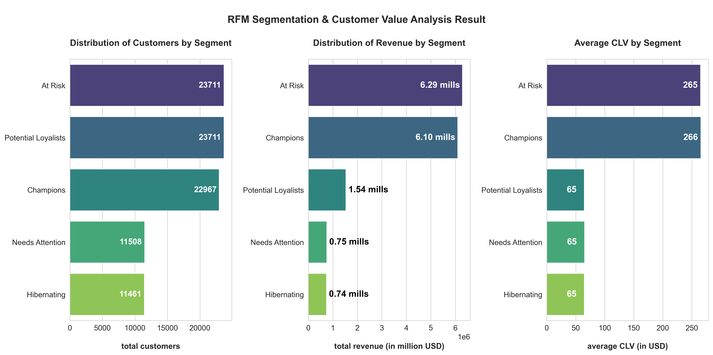
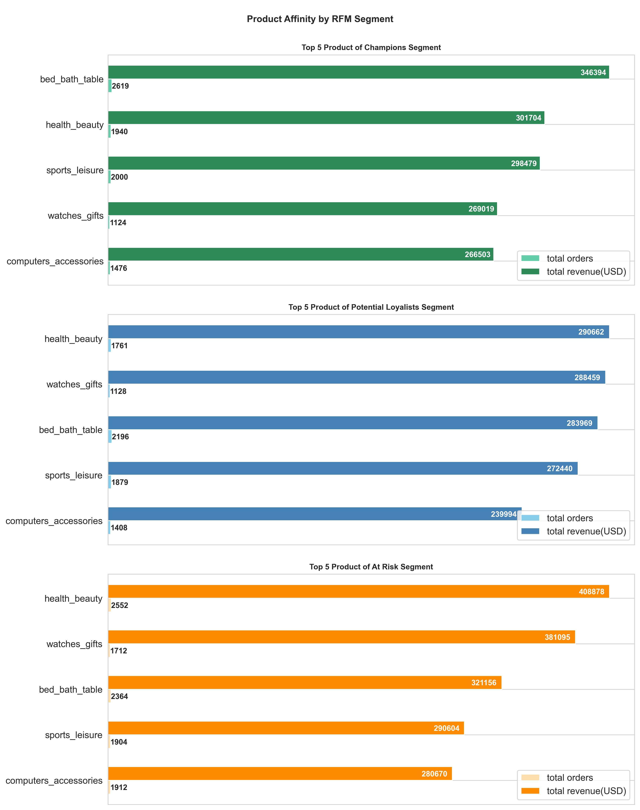
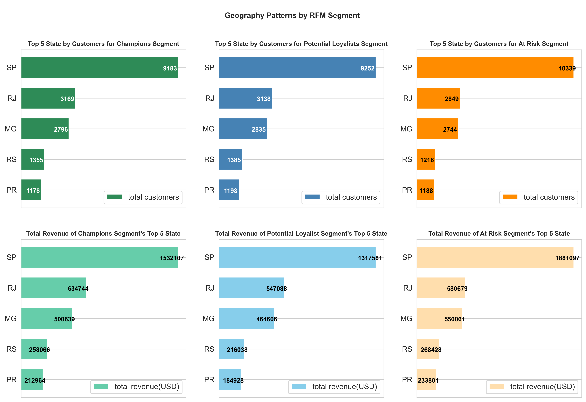
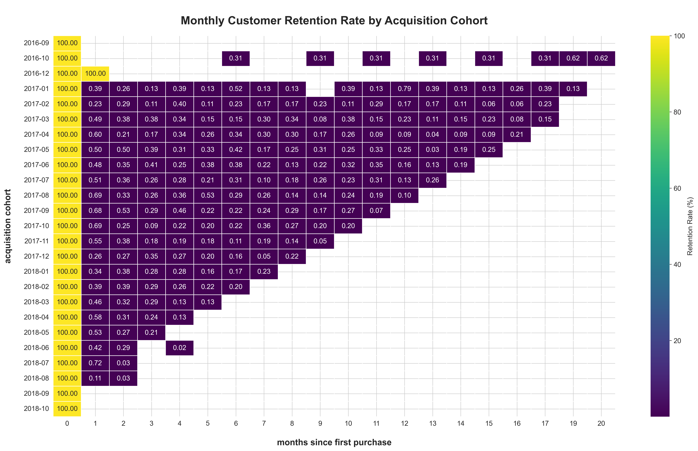
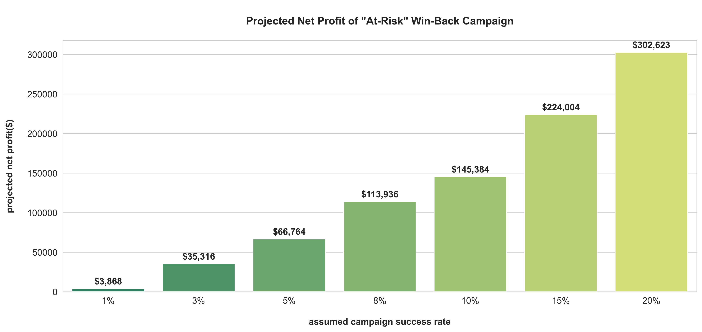
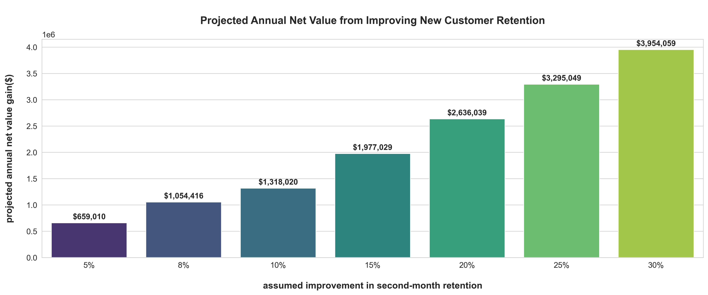

# E-commerce Customer Intelligence: From RFM Segmentation to a Modeled ROI Strategy

This repository showcases an end-to-end data analysis project that transforms raw e-commerce data into a strategic action plan. It demonstrates how to diagnose critical business problems like customer churn and low engagement, and how to build a quantitative, data-driven business case for specific marketing initiatives.

## Table of Contents
- [1. Project Overview](#1-project-overview)
  - [Business Need](#business-need)
  - [Project Objective](#project-objective)
  - [Tech Stack](#tech-stack)
  - [Data Source](#data-source)
  - [Methodology](#methodology)
- [2. Project Structure](#2-project-structure)
- [3. The Analytical Framework (5-Step Methodology)](#3-the-analytical-framework-5-step-methodology)
- [4. Key Findings & Visualizations](#4-key-findings--visualizations)
  - [RFM & Customer Value Analysis](#rfm--customer-value-analysis)
  - [Product & Geographic Affinity](#product--geographic-affinity)
  - [Cohort Retention Analysis](#cohort-retention-analysis)
  - [Opportunity & ROI Modeling](#opportunity--roi-modeling)
- [5. Final Business Recommendations](#5-final-business-recommendations)
- [6. How to Run This Project](#6-how-to-run-this-project)
  - [Prerequisites](#prerequisites)
  - [Setup Instructions](#setup-instructions)

---

## 1. Project Overview

### Business Need
The marketing department at a fictional e-commerce company, "Global Mart," operates with a generic, one-size-fits-all strategy. This leads to inefficient ad spend, missed cross-selling opportunities, and a high rate of customer churn, particularly after the first purchase. The business lacks a quantitative basis for prioritizing marketing initiatives and cannot answer critical questions like:
- Who are our best customers and who are we about to lose?
- Why do we lose so many new customers after their first purchase?
- If we invest in new campaigns, what is the potential Return on Investment (ROI)?

### Project Objective
The primary objective of this project is to create a foundational customer intelligence report using SQL and Python that empowers the marketing team to design targeted and effective campaigns with a clear, projected ROI. This report will diagnose key business problems and provide a data-driven financial justification for action.

### Tech Stack
*   **Database:** PostgreSQL (running in a Docker container)
*   **ETL & Automation:** Docker Compose, Python (`pandas`, `SQLAlchemy`)
*   **Data Analysis:** SQL (PostgreSQL dialect), Python (`pandas`)
*   **Data Visualization:** Python (`matplotlib`, `seaborn`)
*   **Reporting:** Jupyter Notebook

### Data Source
This analysis was performed on the publicly available **Brazilian E-Commerce Public Dataset by Olist** from Kaggle. This rich dataset provides a realistic foundation for modeling the transactional patterns and customer behaviors relevant to the "Global Mart" business case.

### Methodology
The analysis follows a 5-step framework: RFM Segmentation, CLV Analysis, Pattern Discovery (Affinity & Geo-location), Cohort Retention Analysis, and ROI Opportunity Modeling. The full details are available in the [Final Jupyter Notebook report](./customer_intelligence_report.ipynb).

---

## 2. Project Structure
The repository is organized into distinct, modular components for clarity and reproducibility.
``` & data visu
.
├── data/                    # Holds the raw Olist CSV datasets
├── etl/                     # Contains all scripts for the automated ETL pipeline
│   ├── data_validation.py   # Functions to validate raw data
│   ├── data_cleaning.py     # Functions to clean and transform data
│   ├── etl_pipeline.py      # Main script orchestrated by Docker to run the ETL
│   ├── Dockerfile           # Blueprint for the Python ETL service container
│   ├── requirements.txt     # Python dependencies for the ETL service
│   └── wait-for-postgres.sh # Helper script to ensure DB is ready before ingestion
├── output
|   ├── csv                  # Contains the final, clean CSV datasets generated by SQL analysis
|   └── visualization        # Contains all final visualization PNG files                 
├── sql_scripts/             # Contains all production-ready SQL scripts for the analyses
├── .gitignore               # Specifies files to be ignored by Git (e.g., .env)
├── docker-compose.yml       # Orchestrates the entire multi-container application (DB + ETL)
└── customer_intelligence_report.ipynb # The final Jupyter Notebook report
```

---

## 3. The Analytical Framework (5-Step Methodology)

This project follows a comprehensive 5-step analysis, with each step building on the last.

1.  **RFM Segmentation:** Customers were segmented into actionable groups like 'Champions' and 'At Risk' based on their **R**ecency, **F**requency, and **M**onetary behavior.
    *   *Tool:* `SQL` (grouping, aggregation, case expression, JOIN, CTE, `NTILE` window functions)

2.  **CLV Analysis:** The historical monetary value of each RFM segment was quantified to identify the most valuable customer groups and assess financial risk.
    *   *Tool:* `SQL` (grouping, aggregation, case expression, JOIN, CTE, `NTILE` window functions)

3.  **Pattern Discovery (Affinity & Geo-location):** The product and geographic preferences of key segments were identified to provide clear targets for personalized marketing.
    *   *Tool:* `SQL` (grouping, aggregation, case expression, JOIN, CTE, subquery, `NTILE` and `ROW_NUMBER` window functions)

4.  **Longitudinal Retention Analysis (Cohorts):** Customer retention was tracked over time to diagnose critical drop-off points in the customer lifecycle, specifically the "one-and-done" problem.
    *   *Tool:* `SQL` (grouping, aggregation, case expression, JOIN, and CTE)

5.  **Predictive Opportunity Modeling (ROI & Sensitivity Analysis):** The key diagnostic findings were translated into two forward-looking financial models that project the ROI of specific marketing initiatives.
    *   *Tool:* `Python` (`pandas` in Jupyter Notebook)

---

## 4. Key Findings & Visualizations

### RFM & Customer Value Analysis
Over 80% of total revenue is concentrated in the 'Champions' and 'At Risk' segments. Crucially, 'At Risk' customers are not low-value; they are dormant Champions, representing the single largest pool of potential revenue to be reactivated.


### Product & Geographic Affinity
Analysis revealed distinct purchasing patterns for key segments, with 'Champions' over-indexing on high-value goods like `watches_gifts`. Geographically, all key segments are heavily concentrated in the state of São Paulo (SP), making it the primary market for targeted efforts.



### Cohort Retention Analysis
The analysis provided definitive proof of a critical business problem: over 99% of new customers churn after their first purchase and do not return in the second month. This "leaky bucket" is the primary driver of poor customer lifetime value.


### Opportunity & ROI Modeling
Two financial models were built to provide a business case for action.
1.  **"Win-Back" Campaign Model:** Showed that a campaign targeting 'At Risk' customers is profitable even at a minimal 1% success rate, with the potential to generate over **$66,000 in net profit** at a realistic 5% success rate.
2.  **"Welcome Series" Value Model:** Showed that a modest 10% improvement in second-month retention could unlock over **$1.3 million in additional annualized net value**.



---

## 5. Final Business Recommendations

Based on the comprehensive analysis, two key initiatives are recommended:

1.  **(Immediate Priority) Launch a Targeted 'At-Risk' Win-Back Campaign:** Prevent immediate revenue loss by re-engaging our most valuable inactive customers with personalized offers based on their known product affinities.
2.  **(Strategic Priority) Implement a "New Customer Welcome Series":** Address the core retention problem by investing in an automated onboarding email sequence designed to secure the crucial second purchase, thereby fundamentally increasing the lifetime value of all new customers.

---

## 6. How to Run This Project

### Prerequisites
*   Docker and Docker Compose
*   Python 3.8+
*   Access to a terminal or command line

### Setup Instructions
1.  **Clone the Repository:**
    ```bash
    git clone https://github.com/zak-khalwani/ecommerce-customer-intelligence.git
    cd your-repo-name
    ```
2.  **Prepare Environment Variables:**
    *   Create your own `.env` file 
    *   Set your desired `POSTGRES` credentials.

3.  **Launch the Dockerized Environment:**
    *   Run the following command from the project's root directory. This will build the Python ETL container, start the PostgreSQL database, and automatically run the entire ETL pipeline to clean and ingest the data.
    ```bash
    docker-compose up --build
    ```
    *   The process is complete when the `etl_pipeline` container exits with code 0. Your database is now populated and ready.

4.  **Run the Analysis:**
    *   You can now connect to the PostgreSQL database using a client like DBeaver or run the SQL scripts in `sql_scripts/`.
    *   To run the final report, launch Jupyter Notebook:
    ```bash
    jupyter notebook
    ```
    *   Open and run the cells in `customer_intelligence_report.ipynb`.
  
  
